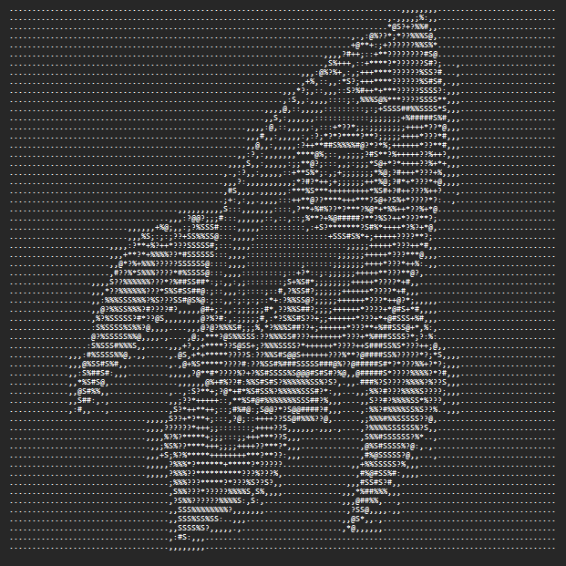

# ASCII Art Generator using Java

A simple Java-based application that converts images into ASCII art using pixel intensity mapping.

---

##  Project Description

This project converts a digital image into ASCII characters.  
Each pixel of the image is analyzed and mapped to a character based on its brightness.

Dark pixels are represented using characters like `@` and `#`, while lighter pixels use `.` or space.

---

##  Project Setup

If you have downloaded the files individually from GitHub, make sure to organize them into a folder like this:
````
ASCII_Project
│
├── MainApp.java
├── ASCIIConverter.java
├── FileHandler.java
├── sample_input1.jpg
├── sample_output1.png
└── README.md

````
This ensures the program runs correctly.


## Features

- Simple and user-friendly GUI  
- Image selection using file chooser  
- Drag and drop support  
- Real-time ASCII output display  
- Save ASCII output to a text file  

---

## Technologies Used

- Java  
- Swing (GUI)  
- BufferedImage  
- FileWriter  

---

## How It Works

1. User selects or drags an image  
2. Image is processed  
3. Converted into ASCII characters  
4. Output is displayed  
5. Output can be saved  

---

## How to Run

> **"Make sure all the `.java` files are placed inside the same folder before compiling."**


1. Place all the `.java` files in the same folder.
2. Open terminal/command prompt in that folder.
3. Compile all files using:


```bash
javac *.java
java MainApp
````

---

## Sample Input & Output

<p align="center">
  <table>
    <tr>
      <th>Input Image</th>
      <th>ASCII Output</th>
    </tr>
    <tr>
      <td align="center">
        
      </td>
      <td align="center">
        
      </td>
    </tr>
  </table>
</p>

---

## Learning Outcomes

* OOP concepts
* GUI development
* File handling
* Image processing basics

---

## Limitations

* Only grayscale ASCII
* Basic GUI

---

## Future Scope

* Colored ASCII
* Better UI
* Video support

---

##  Author

**Jatin Kumar**


---

##  License

This project is for educational purposes.


